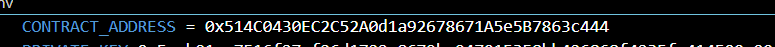
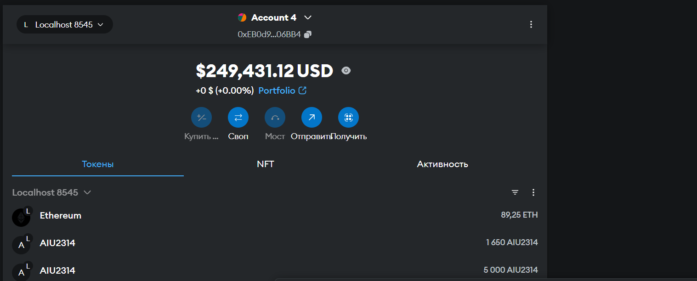

# AstanaItUniversity_SE2314

AIModelMarketplace is a smart contract implementing  with additional functionality to retrieve and display transaction details.

---

## 📋 Description

This smart contract includes the basic functionalities of an ERC-20 token with additional features for transaction handling:
- **Initialization:** Upon deployment, 2000 tokens are created and assigned to the contract creator.
- **Transaction Logging:** Every transaction is logged in an event with detailed information.
- **Transaction Information Retrieval:**
  - Sender address.
  - Receiver address.
  - Timestamp of the last transaction in a readable format.

---

## 🔧 Setup

### Clone the Repository

```bash
git clone https://github.com/your-repository.git
cd your-repository
```


---

### Install Dependencies

```bash
npm install
```


---

### Deploy to Local Network

Run a local blockchain (e.g., Ganache), then deploy the contract:

```bash
npx hardhat run scripts/deploy.js --network ganache
```



---

## 🗒 Usage Examples

## 📷 Screenshots

Here are the key screenshots of the project setup and execution:

1. Clone repository:
   


2. Deploy contract:
   
2. Check balance:
   

3. Example usage:
   - Check balance.
   - Perform a transaction.
   - Retrieve transaction details.

